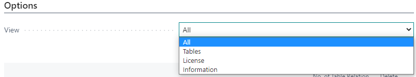

# Admin-Toolbox-OnPrem

I've combined features from a few blog posts into one single app called "Admin-Toolbox":  
- [Record Deletion Tool](https://navinsights.net/2020/04/02/record-deletion-tool/ "Record Deletion Tool, Waldemar Brakowski")
- [View License Information](https://www.waldo.be/2021/01/07/check-customer-license-in-an-onprem-db-from-the-web-client/ "View License Information, Waldo")
- [Import Licenses](https://www.imbatman.info/post/using-powershell-in-microsoft-al-for-business-central-onprem "Import Licenses, Neil Roberts")
- [Not out of the box information for consultants, Waldo](https://www.waldo.be/2020/05/26/getting-not-out-of-the-box-information-with-the-out-of-the-box-web-client/ "Not out of the box information for consultants, Waldo")  

Currently this page is only for OnPrem, because license information can only be displayed OnPrem and for the license import DotNet is used.  
If there is enough demand, I can create a SaaS version without the license area.   

In addition, I have created a How To for consultants so that they can upload the app themselves without the help of developers.  

## How To Install the Toolbox

To enable consultants to use this app, I compiled it for the different Business Central versions.  
You can download these different apps from a separate [GitHub Repository](https://github.com/wbrakowski/Admin-Toolbox-Apps "GitHub Repository").   

The [readme of the repository](https://github.com/wbrakowski/Admin-Toolbox-Apps/blob/main/README.md "readme of the repository") describes the individual steps for the installation.    

Currently the following object numbers are used by the Admin Toolbox:
- Codeunits 50000, 50001
- Enum 50000
- Table 50000, 50001
- Page 50000-50002  

In the toolbox, the languages German and English are maintained.

## How To Use the Toolbox

After successful installation you will find the toolbox under the search term "Admin Toolbox".  

The toolbox is divided into four areas:
- How To
- Options
- License Information
- Information  

The link in the FastTab "How To" will take you directly to the readme you are reading right now.  

You can use the "View" field to control the visibility of the controls in the page.  
When you open the page, all controls are displayed at first.  
If you change the view to "License", only the license information and the corresponding PageActions are displayed.  

### Record Deletion Tool

The Tables area shows you all the tables in the system except the system tables.  
It also contains functionalities to delete records from these tables.    

Part of the following descriptions were copied from [Olof Simren's original post](http://www.olofsimren.com/record-deletion-tool-for-dynamics-nav-2015/ "Olof Simren's original post") for the Record Deletion Tool.  
He created the original version for Microsoft Dynamics NAV.  
I rebuilt the tool and added some new functions to it.   

This data deletion tool is useful if you want to 'clean' a company from transactional data.  
It could for example be that you have been testing transactions in a company that you want to use for a go-live.  
It is also useful if you just want to have a clean company without transactions for a demo, training or testing session.   

Use the PageAction "Insert/Update Tables". This will populate the list with all the tables that are in the database.  
System tables are excluded here. If you afterwards add new tables you can run this function again to have them added.  

After you used the function, the tables are now available in the list.  

Then you go through and select the tables you want to delete records from by checking the "Delete Records" field.  
The PageActrion "Suggest Records to Delete" can suggest records for you to delete by providing you with these two options:
- Suggest all transactional records to delete
- Suggest unlicensed partner or custom records to delete

Use the first option to select the tables you typically want to delete records from when cleaning a company from transactional data.  

Use the second option to suggest unlicensed partner or custom records to delete.  
This may be useful if you used a developer license in the system at some point and created records with that license.  
Now you want to switch back to the customer license and have errors in the system because of these still existing records.
<b>Note:</b> This second option must be used with the customer license.  
After you have suggested the records, you need to import the developer license to delete the records.  

<b>Note that the suggestion of tables may be incomplete or the logic faulty, but for my cases it worked.  
You should always check the suggested records manually afterwards and select additional tables if necessary! </b>   

Also note that I am not responsible if this suggestion selects something you don’t want to delete or skips something that you do want to delete.  

Use the "Clear Records to Delete" function to remove all the selections.  

When you are happy with the selection you press "Delete Records".  
Business Central now goes through the tables and deletes all records from each of the selected tables.  
</b>It might make sense to do a backup of the data before you do this. </b>   

I typically just copy the company before this step, so at least you have a company that can easily be restored or copy/paste data from.  

Note that you can delete records either by running the deletion trigger or not.  
The default option is to delete records without using the deletion trigger.  

Before the deletion is being executed, you get an information how many tables were marked for deletion.  

After pressing "Yes", you can watch the system do its work.  

 

...and you get a success message after the operation has finished.  

 

Note that the field "No. of Records" is updated after the operation.  

After the records have been deleted it is recommended to review the tables that still have data in them to make sure you have not missed anything.  
The easiest way to do this is to just apply a filter on the "No. of Records" field to be <>0.  

Use the "View Records" function to view the records in the tables.  
When selecting "View Records" the table will be run to show all the records and all the fields, like below.  

When looking at the records it is typically quite easy to see if they should have been deleted or not.  
If the records has an entry number, document number, etc. it is most likely transactional data that should be deleted.  
The number of records in the table could sometimes also give you a hint if it should be deleted or not.    

The next option when reviewing the remaining data is to use the "Check Table Relations" function.  
This function runs through all records and uses the field relations defined in the table "Field" in Business Central to validate the table relations.  
It does so by just looking if the related record is in the database or not.  
Note that this only checks the very basic relations where a field has a table relation to a field in another table.  
This is similar to the table relations you find in the FactBox in the configuration worksheet.  
It does not check table relations that involve multiple fields or conditional table relations.  
It is still a good check I think.  

As this is a time consuming operation, you need to confirm before the table relations are being checked.  

Watch the system work.  

After the check on the table relations has run you can set a filter on the "No. of Table Relations Errors" to be <> 0.  
 You should then see if there are any basic table relation errors.  

 

 If there are any errors you can make a drilldown on the number to see the errors.  

 

 These are the table relation errors in my example:  

 

 As mentioned above, the table relation check is only doing a basic check, so don’t rely too much on it.  
 If you have a large amount of master data it might also take a while to run.  

 ### License Overview and Import

 The area "License" shows you the license information.  
 It is using the field "Text" from the table "License Information" to present you the information.  

You can import a new license by using the "Manage" -> "Import License" function.  

Select a new license file and be happy.  

### Links to Informational Tables

Find links to useful tables in the area "Information". I used the links from [Waldo's blogpost](https://www.waldo.be/2020/05/26/getting-not-out-of-the-box-information-with-the-out-of-the-box-web-client/, "Waldo's Blogpost").  

By clicking on a link a new tab will be created that leads you to the page.  

 

 
