# Admin-Toolbox-OnPrem

I've combined features from different blog posts into one single app called "Admin-Toolbox":  
- [Record Deletion Tool, Waldemar Brakowski](https://navinsights.net/2020/04/02/record-deletion-tool/ "Record Deletion Tool, Waldemar Brakowski")
- Table Editor, Yuri Mishin
- [View License Information, Waldo](https://www.waldo.be/2021/01/07/check-customer-license-in-an-onprem-db-from-the-web-client/ "View License Information, Waldo")
- [Import Licenses, Neil Roberts](https://www.imbatman.info/post/using-powershell-in-microsoft-al-for-business-central-onprem "Import Licenses, Neil Roberts")
- Show Developer License Warning, Yuri Mishin
- [Not out of the box information for consultants, Waldo](https://www.waldo.be/2020/05/26/getting-not-out-of-the-box-information-with-the-out-of-the-box-web-client/ "Not out of the box information for consultants, Waldo") 
- [Enabling External Deployment in OnPrem Business Central Environments, Waldo](https://www.waldo.be/2020/06/15/deploying-from-devops-the-right-way-enabling-external-deployment-in-onprem-business-central-environments/ "Enabling External Deployment in OnPrem Business Central Environments")  
- [See used and not used Objects, Roberto Stefanetti](https://robertostefanettinavblog.com/2022/03/29/used-and-not-used-objects-in-business-central-license/ "See used and not used Objects, Roberto Stefanetti")
- Export Unlicensed Objects, Waldemar Brakowski

Currently this page is only for OnPrem, because license information can only be displayed OnPrem and for the license import DotNet is used.  
If there is enough demand, I can create a SaaS version without the license area.   

<b>IMPORTANT: This app contains very powerful features. Be careful when using them. If not used with care, you may lose data or create a mess in your system. Please make sure to create backups of your company before deleting or modifying records with this app!</b>

## How To Install the Toolbox

Clone this repository. Modify the app.json so it fits your Business Central version. Move the correct powershell runner from the folder "powershellrunners" to the folder ".netpackages". Make sure that there is only one powershell runner dll in the folder ".netpackages" to avoid weird errors.

In the toolbox, the languages German, English and Spanish are maintained.
Please note that the Spanish translation is probably not 100% accurate as it was translated by DeepL.

## How To Use the Toolbox

After successful installation you will find the toolbox under the search term "Admin Toolbox".  

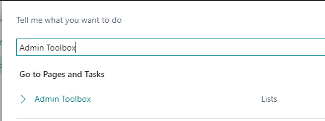

Users without SUPER permission will receive an error when opening the Admin Toolbox page.

When opening the Admin Toolbox the first time, you can take a guided tour to show you the functionalities. If you open the page again and the guided tour does not appear, just click the page caption "Admin Toolbox" to reenable it.

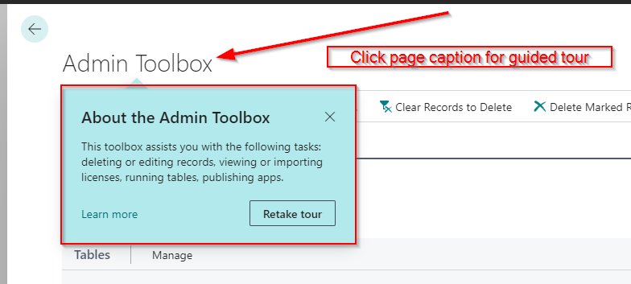

The toolbox is divided into 4 areas:
- How To
- Tables
- License Information
- Information  

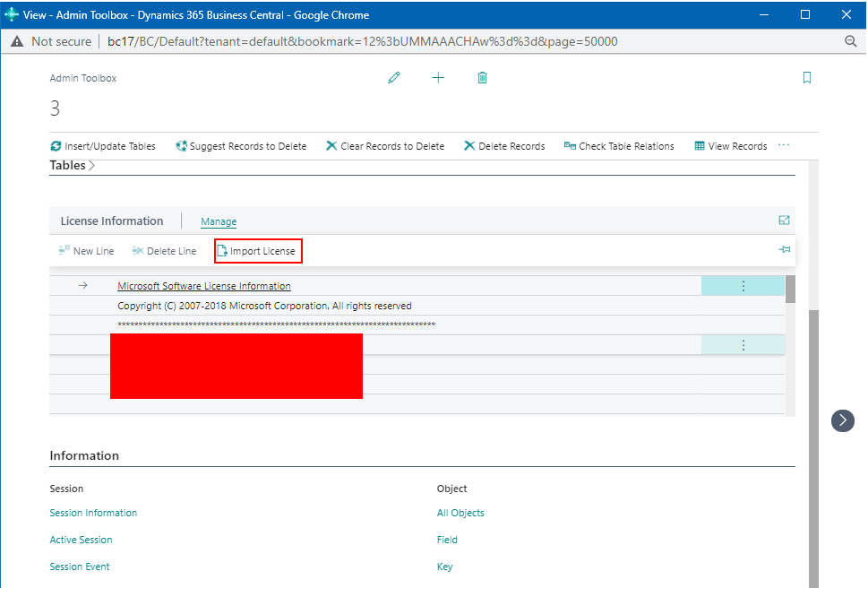

The link in the FastTab "How To" will take you directly to the readme you are reading right now.  

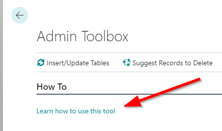

### Record Deletion Tool

The Tables area shows you all the tables in the system except the system tables.  
It also contains functionalities to delete records from these tables.   

Part of the following descriptions were copied from [Olof Simren's original post](http://www.olofsimren.com/record-deletion-tool-for-dynamics-nav-2015/ "Olof Simren's original post") for the Record Deletion Tool.  
He created the original version for Microsoft Dynamics NAV.  
I rebuilt the tool and added some new functions to it.   

This data deletion tool is useful if you want to 'clean' a company from transactional data.  
It could for example be that you have been testing transactions in a company that you want to use for a go-live.  
It is also useful if you just want to have a clean company without transactions for a demo, training or testing session.   

Use the PageAction "Insert/Update Tables". This will populate the list with all the tables that are in the database.  
The "Insert/Update Tables" function will be automatically executed the first time you open the page.  
System tables are excluded here. If you afterwards add new tables you can run this function again to have them added.  

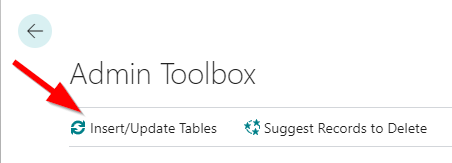

After you used the function, the tables are now available in the list.  

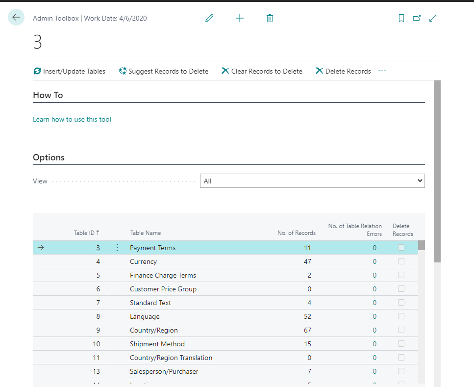

Then you go through and select the tables you want to delete records from by checking the "Delete Records" field.  
The PageActrion "Suggest Records to Delete" can suggest records for you to delete by providing you with these two options:
- Suggest all transactional records to delete
- Suggest unlicensed partner or custom records to delete

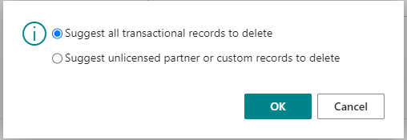

Use the first option to select the tables you typically want to delete records from when cleaning a company from transactional data.  

Use the second option to suggest unlicensed partner or custom records to delete.  
This may be useful if you used a developer license in the system at some point and created records with that license.  
Now you want to switch back to the customer license and have errors in the system because of these still existing records.
<b>Note:</b> This second option must be used with the customer license.  
If the tool detects that you are currently using a developer license, it will ask you if you want to import a customer license instead.  
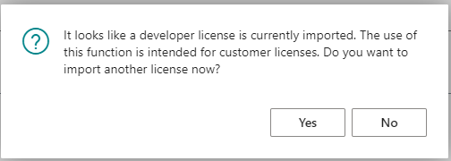

After you have suggested the records, you need to import the developer license to delete the records.  
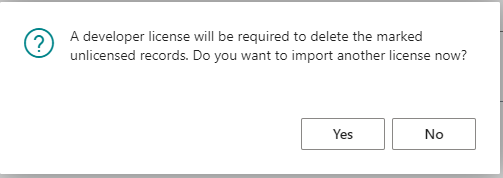

<b>Note that the suggestion of tables may be incomplete or the logic faulty, but for my cases it worked.  
You should always check the suggested records manually afterwards and select additional tables if necessary! </b>   

Also note that I am not responsible if this suggestion selects something you don’t want to delete or skips something that you do want to delete.  

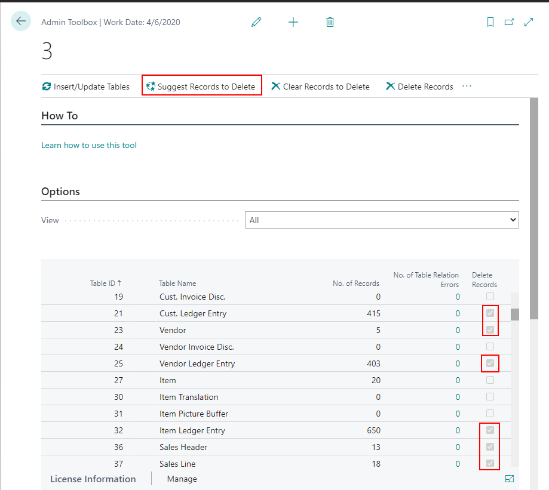

Use the "Clear Records to Delete" function to remove all the selections.  

When you are happy with the selection you press "Delete Records".  
Business Central now goes through the tables and deletes all records from each of the selected tables.  
</b>It might make sense to do a backup of the data before you do this. </b>   

I typically just copy the company before this step, so at least you have a company that can easily be restored or copy/paste data from.  

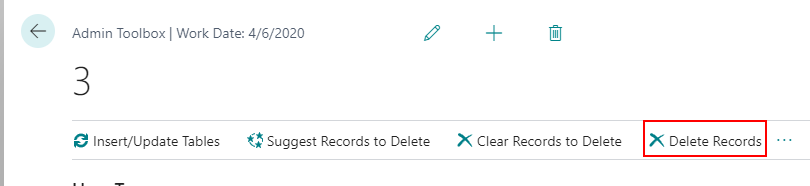

Note that you can delete records either by running the deletion trigger or not.  
The default option is to delete records without using the deletion trigger.  

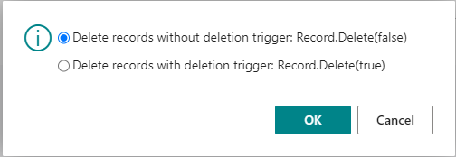

Before the deletion is being executed, you get an information how many tables were marked for deletion.  

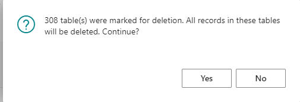

After pressing "Yes", you can watch the system do its work.  

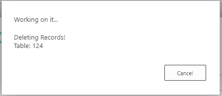 

...and you get a success message after the operation has finished.  

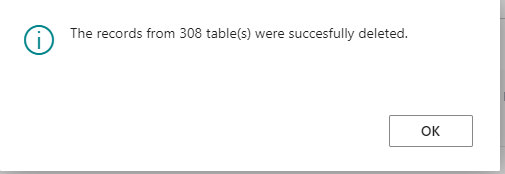 

Note that the field "No. of Records" is updated after the operation.  

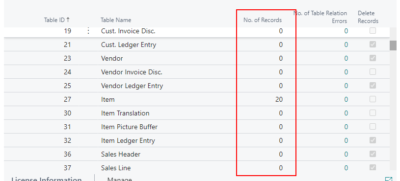

After the records have been deleted it is recommended to review the tables that still have data in them to make sure you have not missed anything.  
The easiest way to do this is to just apply a filter on the "No. of Records" field to be <>0.  

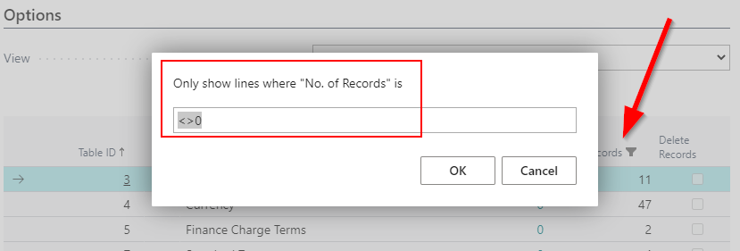

Use the "View Records" function to view the records in the tables.  
When selecting "View Records" the table will be run to show all the records and all the fields, like below.  

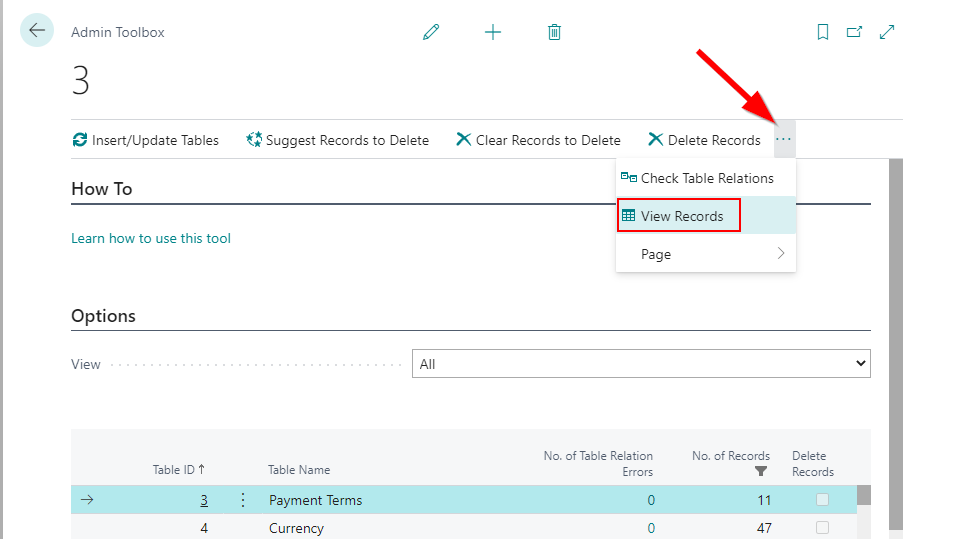

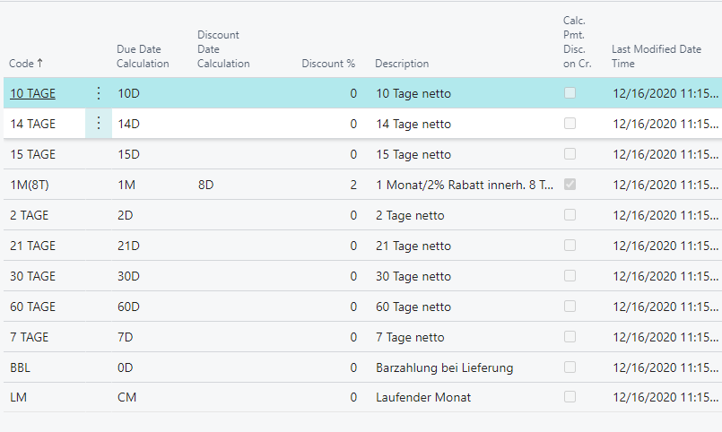

When looking at the records it is typically quite easy to see if they should have been deleted or not.  
If the records has an entry number, document number, etc. it is most likely transactional data that should be deleted.  
The number of records in the table could sometimes also give you a hint if it should be deleted or not.  

The next option when reviewing the remaining data is to use the "Check Table Relations" function.  
This function runs through all records and uses the field relations defined in the table "Field" in Business Central to validate the table relations.  
It does so by just looking if the related record is in the database or not.  

Note that this only checks the very basic relations where a field has a table relation to a field in another table.  
This is similar to the table relations you find in the FactBox in the configuration worksheet.  
It does not check table relations that involve multiple fields or conditional table relations.  
It is still a good check I think.  

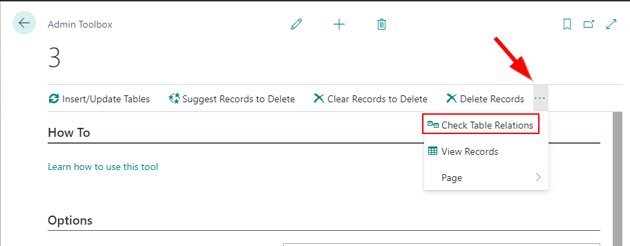

As this is a time consuming operation, you need to confirm before the table relations are being checked.  

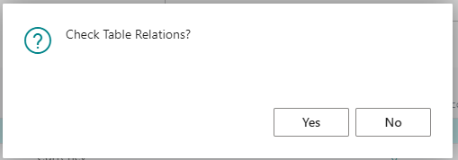

Watch the system work.  

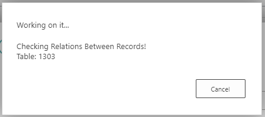

After the check on the table relations has run you can set a filter on the "No. of Table Relations Errors" to be <> 0.  
 You should then see if there are any basic table relation errors.  

 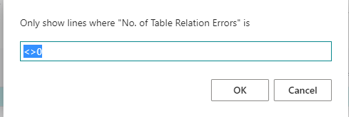

 If there are any errors you can make a drilldown on the number to see the errors.  

 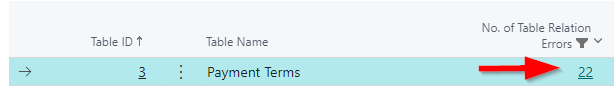

 These are the table relation errors in my example:  

 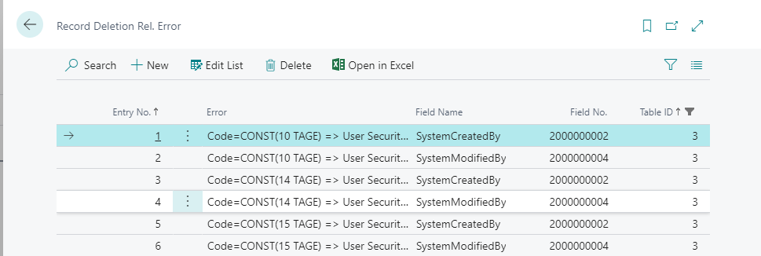

 As mentioned above, the table relation check is only doing a basic check, so don’t rely too much on it.  
 If you have a large amount of master data it might also take a while to run.  

 ### Table Editor
 A big thanks goes to my former colleague [Yuri Mishin](https://www.linkedin.com/in/yuri-mishin-2a08a71b4/ "Yuri Mishin") who programmed the main functionality of this table editor.

 Select any table in the table overview and use the page action "Edit Table".

 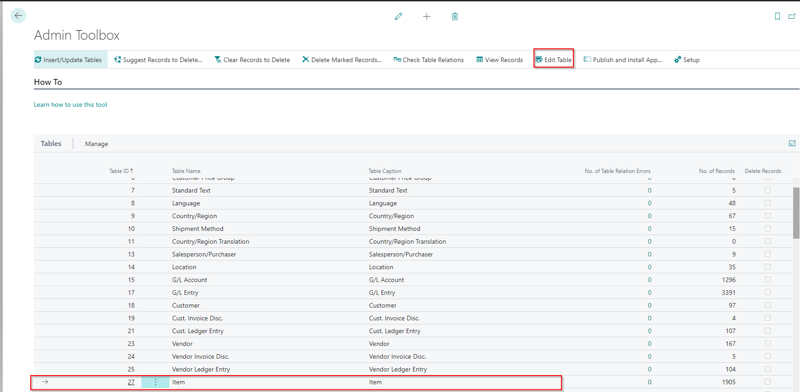

 This will open the table editor where you can use the following fields:

 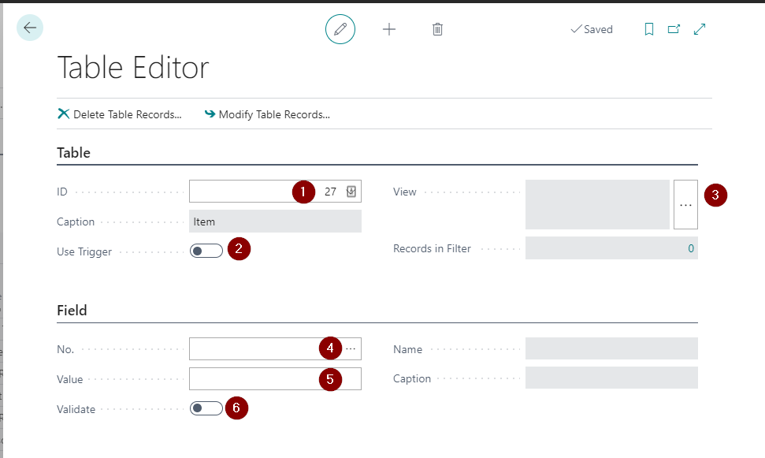

 1) ID: This is preselected with the table that you selected in the table overview. It is the table where you want to edit or delete records.
 2) Use Trigger: If enabled, the table triggers OnModify/OnDelete will be used when deleting or modifying records.
 3) View: Opens a request page to filter the records that you want to modify or delete.
 4) No.: If you want to modify a field in your filtered records, select the field here.
 5) Value: The new value for the selected field after modifying the records.
 6) Validate: If enabled, the OnValidate trigger of the field will be used when modifying the records.

After you have set your values, use the actions "Delete Table Records" or "Modify Table Records" to delete or modify the records. A confirmation dialog will appear before the operation is being executed.

 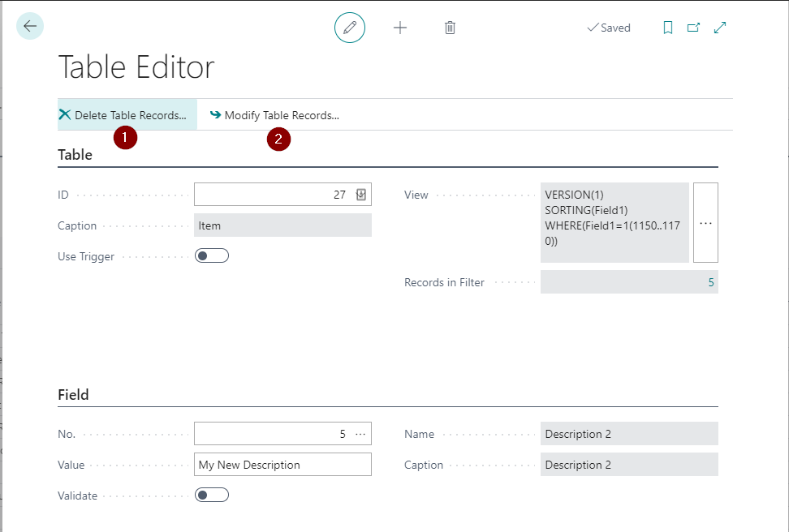

 When deleting:

 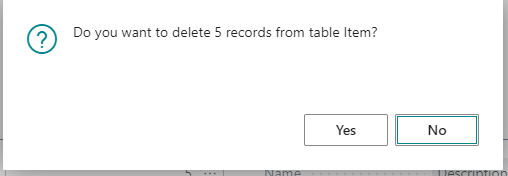

 When modifying:

 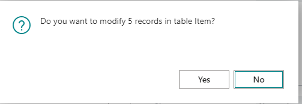

 ### Publishing & Installing Apps

You can publish apps from the Admin Toolbox. This functionality is disabled by default in OnPrem installations.  
In order to publish an app, you first need to install the external deployer.  
For this reason, a dialog opens. It asks you if you want to learn how to install the deployer or simply publish an app.  
By clicking "Learn how to install the external deployer", a new tab will open that leads to the how-to guide.  
If you have not already installed the deployer, you should first to this before you publish an app.  
Otherwise you will run into errors when trying to publish the app.  

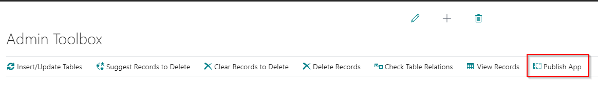

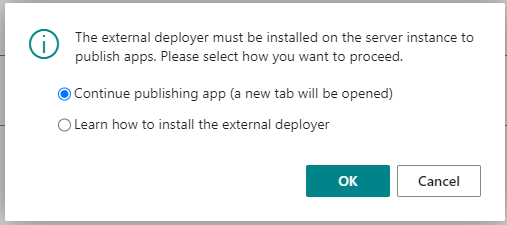

Once you have installed the deployer, run the "Publish App" PageAction again and select "Continue publishing app (a new tab will be opened)".  
This will open the default "publish app" dialog like shown below:  

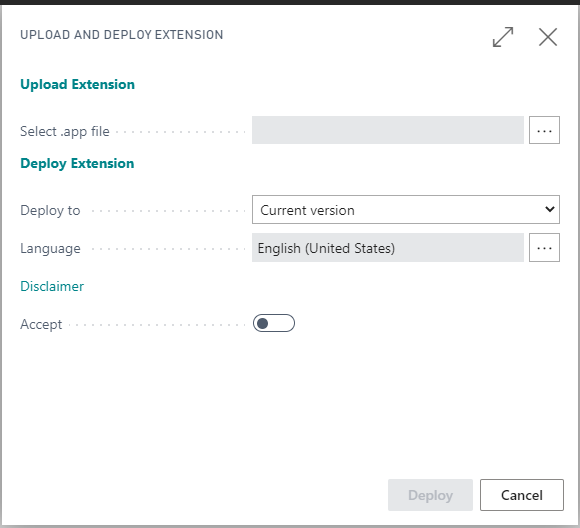

 ### License Overview and Import

 The area "License" shows you the license information.  
 It is using the field "Text" from the table "License Information" to present you the information.  

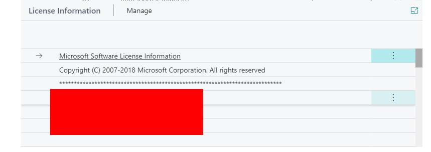

You can import a new license by using the "Manage" -> "Import License" function.  

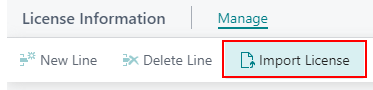

Select a new license file and be happy.  

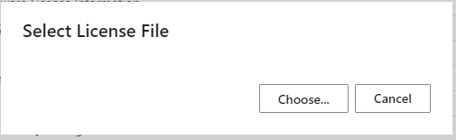

There is a boolean field "Developer License" showing you if your active license is a developer license.

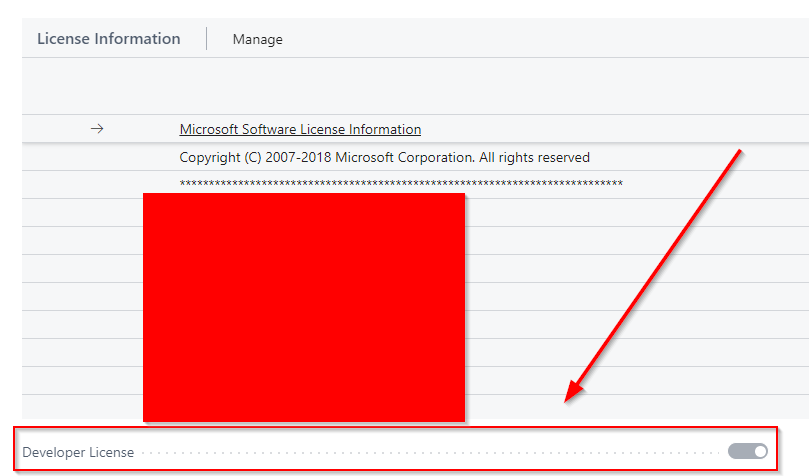

### Links to Informational Tables

Find links to useful tables in the area "Information". I used the links from [Waldo's blogpost](https://www.waldo.be/2020/05/26/getting-not-out-of-the-box-information-with-the-out-of-the-box-web-client/, "Waldo's Blogpost").  

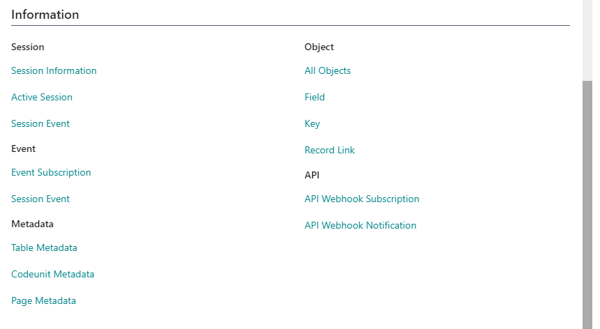

By clicking on a link a new tab will be created that leads you to the page.  

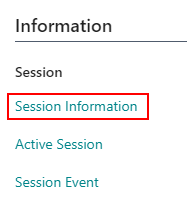 

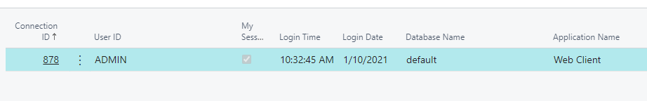 

### Show Developer License Warning

Open the setup for the Admin Toolbox if you want to activate additional functionalities of the Admin Toolbox. Currently, there is only one additional functionality.

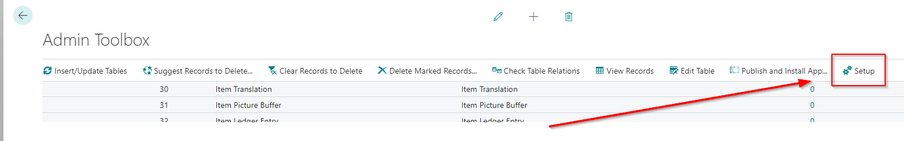 

If "Developer License Warning" is enabled, a message will be shown OnCompanyOpen that the developer license is active. Enable this field in test environments to make sure that no developer license is wrongfully imported.

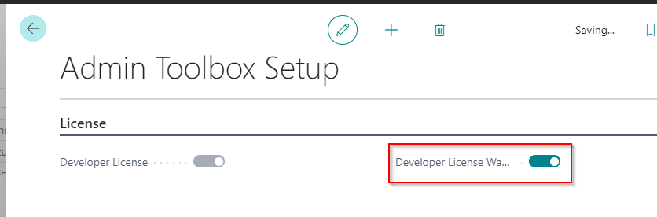 

When opening Business Central, users with SUPER rights will receive this message:

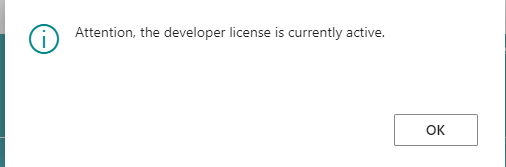 

### How to Install the External Deployer

The following content is copied from waldo's original blog post. [More info about the external deployer: Deploying from DevOps the right way: enabling External Deployment in OnPrem Business Central environments](https://www.waldo.be/2020/06/15/deploying-from-devops-the-right-way-enabling-external-deployment-in-onprem-business-central-environments/ "More info about the external deployer: Deploying from DevOps the right way: enabling External Deployment in OnPrem Business Central environments")

>Disclaimer
>The tool is a hack, nothing more than that. We simulate the behavior of what we think happens on the SaaS environment when you upload an Extension through the Automation API.   
>So, the tool is “as is”, there is no official support other than me not want you to suffer problems with it ;-).  
>There is a github where you can share your feedback.  
>The tool is dependent on how Business Central will evolve in this matter – and we hope this will “just work” for many updates to come.  
>It will work on an decent install of >Business Central. Not on any kind of Copy/Paste or other non-standard installation.  

>So, we created a PowerShell module, that makes it pretty easy to enable the External Deployer on any OnPrem environment.  
>In fact, with 4 lines of PowerShell, you’ll have it >up-and-running!  
>Run this PowerShell on the environment that is running your NST where you would like to deploy to.  

>1. Install ALOps.ExternalDeployer: this will install the PowerShell module on the machine  

><b>install-module ALOps.ExternalDeployer -Force </b> 
>2. Load the module: this will simply load the necessary commandlets in memory:  

><b>import-module ALOps.ExternalDeployer </b> 
>3. Install the External Deployer: this will install an agent that will take care of the app-publish and install whenever you upload an app through the Automation API, or the >upload page.

><b>Install-ALOpsExternalDeployer </b> 
>4. Link the ExternalDeployer to right NST: it will update and restart the NST with the settings needed for the External Deployer.  

><b>New-ALOpsExternalDeployer -ServerInstance BC" </b>

