# Admin-Toolbox-OnPrem

## Overview

The **Admin-Toolbox** is a comprehensive administrative tool for Microsoft Dynamics 365 Business Central OnPrem environments. It consolidates multiple powerful features from various community contributions into one cohesive application, providing administrators and consultants with essential tools for database management, license administration, and system maintenance.

### Features

This toolbox combines the following features and contributions:
- **[Record Deletion Tool](https://navinsights.net/2020/04/02/record-deletion-tool/)** by Waldemar Brakowski - Delete transactional data from multiple tables
- **Table Editor** by Yuri Mishin - Modify or delete specific records in any table
- **[View License Information](https://www.waldo.be/2021/01/07/check-customer-license-in-an-onprem-db-from-the-web-client/)** by Waldo - View current license details and permissions
- **[Import Licenses](https://www.imbatman.info/post/using-powershell-in-microsoft-al-for-business-central-onprem)** by Neil Roberts - Import license files using PowerShell
- **Show Developer License Warning** by Yuri Mishin - Alert users when a developer license is active
- **[System Information Tables](https://www.waldo.be/2020/05/26/getting-not-out-of-the-box-information-with-the-out-of-the-box-web-client/)** by Waldo - Quick access to useful system tables
- **[External Deployment Support](https://www.waldo.be/2020/06/15/deploying-from-devops-the-right-way-enabling-external-deployment-in-onprem-business-central-environments/)** by Waldo - Enable app publishing in OnPrem environments
- **[Used and Unused Objects](https://robertostefanettinavblog.com/2022/03/29/used-and-not-used-objects-in-business-central-license/)** by Roberto Stefanetti - Identify which licensed objects are actually used
- **Export Unlicensed Objects** by Waldemar Brakowski - List all objects not covered by the current license

> **Note:** This application is designed specifically for OnPrem environments because license information can only be accessed in OnPrem installations and the license import functionality requires DotNet. A SaaS version without the license management features could be created if there is sufficient demand.

### ⚠️ IMPORTANT WARNING

**This app contains very powerful features that can modify or delete data in your database. Use these features with extreme caution!**

- Always create a **full backup** of your company before deleting or modifying records
- Test operations in a development or test environment first
- Understand the implications of each operation before proceeding
- Incorrect use may result in data loss or system instability

---

## Table of Contents

1. [Prerequisites and Requirements](#prerequisites-and-requirements)
2. [Installation](#installation)
3. [How to Use the Toolbox](#how-to-use-the-toolbox)
   - [Record Deletion Tool](#record-deletion-tool)
   - [Table Editor](#table-editor)
   - [Publishing & Installing Apps](#publishing--installing-apps)
   - [License Overview and Import](#license-overview-and-import)
   - [Export License Object Information](#export-license-object-information)
   - [Links to Informational Tables](#links-to-informational-tables)
   - [Show Developer License Warning](#show-developer-license-warning)
4. [How to Install the External Deployer](#how-to-install-the-external-deployer)
5. [Support and Contributions](#support-and-contributions)

---

---

## Prerequisites and Requirements

### System Requirements
- **Business Central OnPrem** version 15.0 or higher
- The app version in `app.json` must match your Business Central platform version
- User must have **SUPER** permissions to access the Admin Toolbox

### Technical Requirements
- **.NET Package**: PowerShell Runner DLL matching your BC version (included in `powershellrunners` folder)
- **PowerShell**: Required for license import functionality
- **Database Access**: Full read/write permissions to the Business Central database

### Supported Languages
The toolbox currently supports the following languages:
- English (en-US)
- German (de-DE)
- Spanish (es-ES)

> **Note:** The Spanish translation was generated using DeepL and may not be 100% accurate. Contributions to improve translations are welcome.

---

## Installation

Follow these steps to install the Admin Toolbox in your Business Central OnPrem environment:

### Step 1: Clone or Download the Repository
```powershell
git clone https://github.com/wbrakowski/Admin-Toolbox-OnPrem.git
```

### Step 2: Configure the App Version
1. Open `app.json` in the root folder
2. Verify that the `platform` and `application` versions match your Business Central installation
3. Update the version numbers if necessary:
   ```json
   "platform": "27.0.0.0",
   "application": "27.0.0.0"
   ```

### Step 3: Install the Correct PowerShell Runner
1. Navigate to the `powershellrunners` folder
2. Identify the DLL that matches your Business Central major version:
   - `15_Microsoft.Dynamics.Nav.PowerShellRunner.dll` for BC 15
   - `16_Microsoft.Dynamics.Nav.PowerShellRunner.dll` for BC 16
   - `17_Microsoft.Dynamics.Nav.PowerShellRunner.dll` for BC 17
   - `18_Microsoft.Dynamics.Nav.PowerShellRunner.dll` for BC 18
   - `19_Microsoft.Dynamics.Nav.PowerShellRunner.dll` for BC 19
   - `20_Microsoft.Dynamics.Nav.PowerShellRunner.dll` for BC 20 and higher
3. Create a folder named `.netpackages` in the app root directory (if it doesn't exist)
4. Copy the appropriate DLL to the `.netpackages` folder
5. Rename it to `Microsoft.Dynamics.Nav.PowerShellRunner.dll` (remove the version prefix)

> **Important:** Only one PowerShell Runner DLL should be present in the `.netpackages` folder to avoid conflicts.

### Step 4: Compile and Publish the App
1. Compile the app using AL Language extension in VS Code or your preferred development tool
2. Publish the app to your Business Central server:
   ```powershell
   Publish-NAVApp -ServerInstance YourServerInstance -Path "path\to\app.app" -SkipVerification
   ```
3. Install the app on your desired companies:
   ```powershell
   Install-NAVApp -ServerInstance YourServerInstance -Name "Admin-Toolbox"
   ```

### Step 5: Verify Installation
1. Open Business Central Web Client
2. Search for "Admin Toolbox" using the search function (Alt+Q or Tell Me)
3. The Admin Toolbox page should appear in the search results

---

## How to Use the Toolbox

### Accessing the Admin Toolbox

After successful installation, you can access the toolbox through the search function in Business Central:

1. Press **Alt+Q** or click the search icon (🔍) in the top menu
2. Type "Admin Toolbox" in the search field
3. Click on the Admin Toolbox page to open it

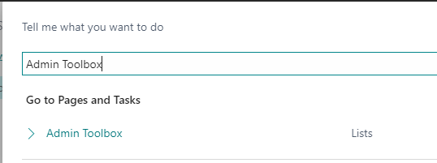

> **Security Note:** Users without SUPER permissions will receive an error when attempting to open the Admin Toolbox page. This is a security measure to ensure only authorized administrators can access these powerful features.

### Guided Tour

When opening the Admin Toolbox for the first time, a guided tour will automatically appear to help you understand the available functionalities. 

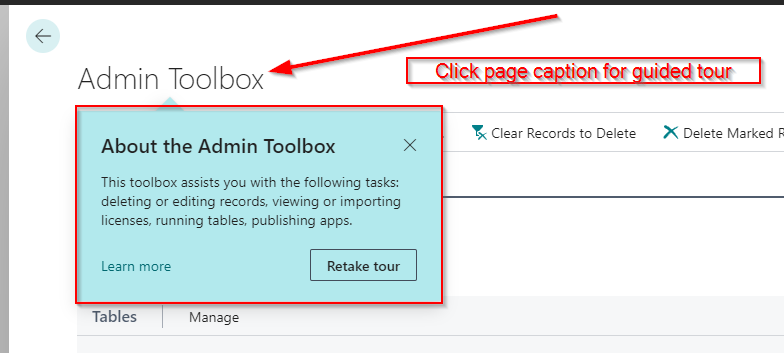

If you dismiss the guided tour and want to see it again later, simply click on the page caption "Admin Toolbox" to re-enable it.

### Toolbox Structure

The Admin Toolbox is organized into four main areas:

1. **How To** - Quick link to this documentation
2. **Tables** - Record deletion tool and table editor for data management
3. **License Information** - View license details, import licenses, and export object lists (OnPrem only)
4. **Information** - Quick access to useful system tables and information

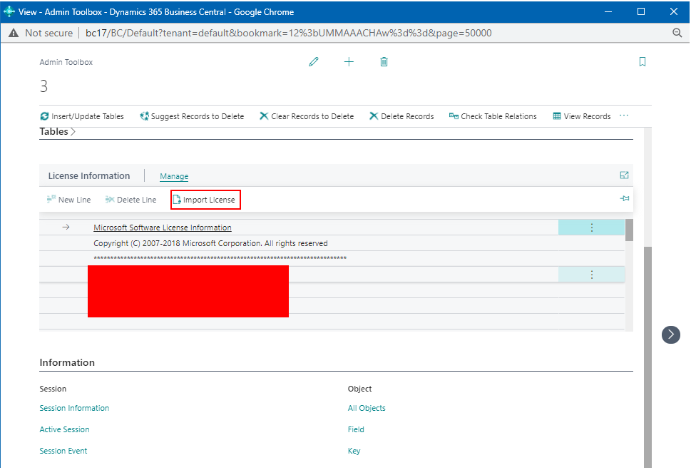

The **How To** section provides a direct link to this README documentation for quick reference.

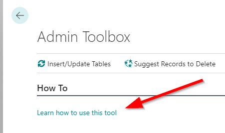

---

### Record Deletion Tool

The Tables area shows you all the tables in the system except the system tables. </br>
It also contains functionalities to delete records from these tables. </br> 

Part of the following descriptions were copied from [Olof Simren's original post](http://www.olofsimren.com/record-deletion-tool-for-dynamics-nav-2015/ "Olof Simren's original post") for the Record Deletion Tool. </br>
He created the original version for Microsoft Dynamics NAV. </br>
I rebuilt the tool and added some new functions to it. </br> 

This data deletion tool is useful if you want to 'clean' a company from transactional data. </br>
It could for example be that you have been testing transactions in a company that you want to use for a go-live. </br>
It is also useful if you just want to have a clean company without transactions for a demo, training or testing session. </br> 

Use the PageAction "Insert/Update Tables". This will populate the list with all the tables that are in the database. </br>
The "Insert/Update Tables" function will be automatically executed the first time you open the page. </br>
System tables are excluded here. If you afterwards add new tables you can run this function again to have them added. </br>

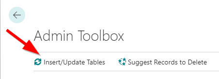

After you used the function, the tables are now available in the list. </br>

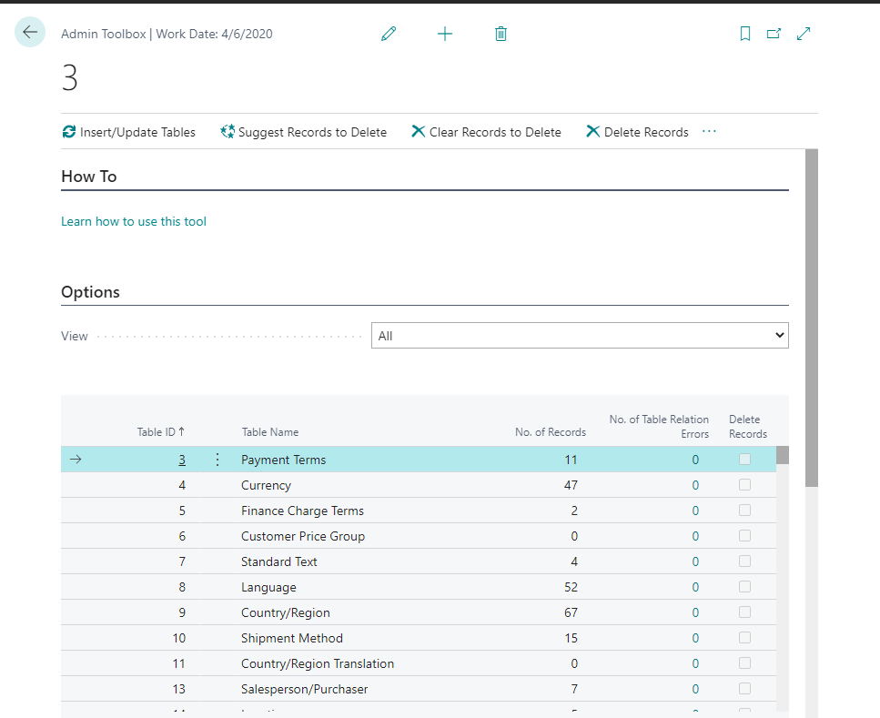

Then you go through and select the tables you want to delete records from by checking the "Delete Records" field. </br>
The PageActrion "Suggest Records to Delete" can suggest records for you to delete by providing you with these two options:
- Suggest all transactional records to delete
- Suggest unlicensed partner or custom records to delete

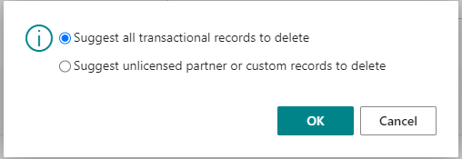

Use the first option to select the tables you typically want to delete records from when cleaning a company from transactional data. </br>

Use the second option to suggest unlicensed partner or custom records to delete. </br>
This may be useful if you used a developer license in the system at some point and created records with that license. </br>
Now you want to switch back to the customer license and have errors in the system because of these still existing records.
<b>Note:</b> This second option must be used with the customer license. </br>
If the tool detects that you are currently using a developer license, it will ask you if you want to import a customer license instead. </br>
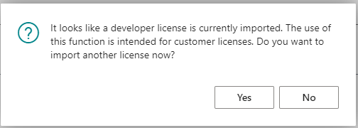

After you have suggested the records, you need to import the developer license to delete the records. </br>
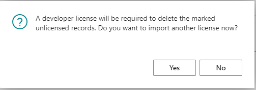

<b>Note that the suggestion of tables may be incomplete or the logic faulty, but for my cases it worked. </br>
You should always check the suggested records manually afterwards and select additional tables if necessary! </b> </br> 

Also note that I am not responsible if this suggestion selects something you don’t want to delete or skips something that you do want to delete. </br>

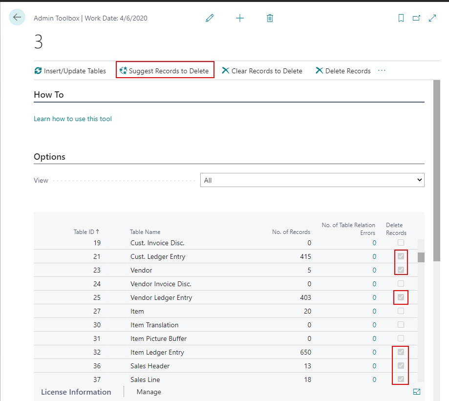

Use the "Clear Records to Delete" function to remove all the selections. </br>

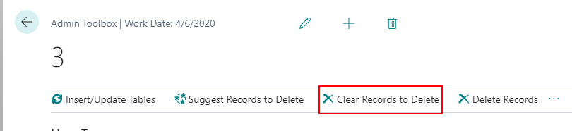

When you are happy with the selection you press "Delete Records". </br>
Business Central now goes through the tables and deletes all records from each of the selected tables. </br>
</b>It might make sense to do a backup of the data before you do this. </b> </br> 

I typically just copy the company before this step, so at least you have a company that can easily be restored or copy/paste data from. </br>

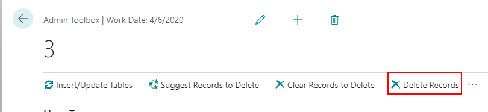

Note that you can delete records either by running the deletion trigger or not. </br>
The default option is to delete records without using the deletion trigger. </br>

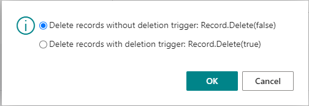

Before the deletion is being executed, you get an information how many tables were marked for deletion. </br>

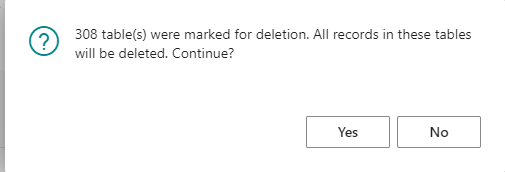

After pressing "Yes", you can watch the system do its work. </br>

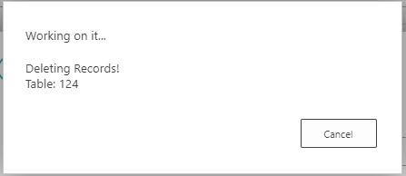 

...and you get a success message after the operation has finished. </br>

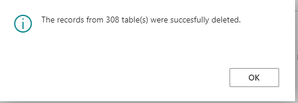 

Note that the field "No. of Records" is updated after the operation. </br>

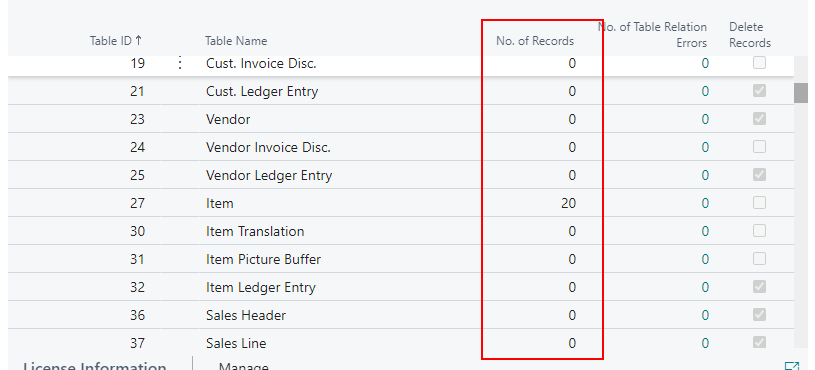

After the records have been deleted it is recommended to review the tables that still have data in them to make sure you have not missed anything. </br>
The easiest way to do this is to just apply a filter on the "No. of Records" field to be <>0. </br>

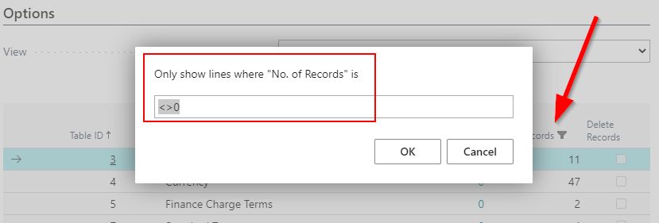

Use the "View Records" function to view the records in the tables. </br>
When selecting "View Records" the table will be run to show all the records and all the fields, like below. </br>

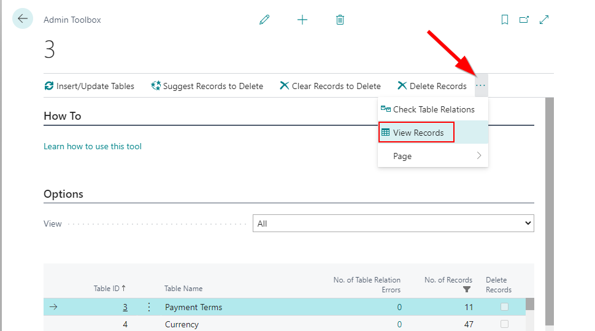

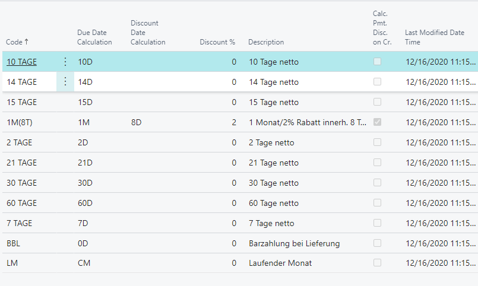

When looking at the records it is typically quite easy to see if they should have been deleted or not. </br>
If the records has an entry number, document number, etc. it is most likely transactional data that should be deleted. </br>
The number of records in the table could sometimes also give you a hint if it should be deleted or not. </br>

The next option when reviewing the remaining data is to use the "Check Table Relations" function. </br>
This function runs through all records and uses the field relations defined in the table "Field" in Business Central to validate the table relations. </br>
It does so by just looking if the related record is in the database or not. </br>

Note that this only checks the very basic relations where a field has a table relation to a field in another table. </br>
This is similar to the table relations you find in the FactBox in the configuration worksheet. </br>
It does not check table relations that involve multiple fields or conditional table relations. </br>
It is still a good check I think. </br>

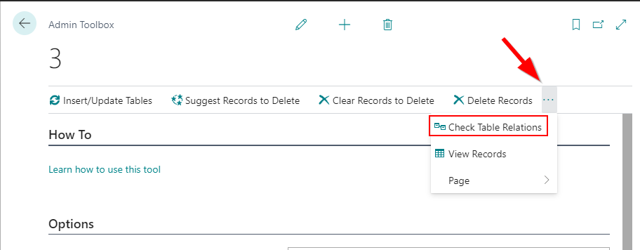

As this is a time consuming operation, you need to confirm before the table relations are being checked. </br>

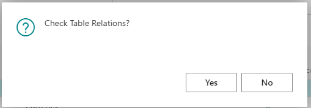

Watch the system work. </br>

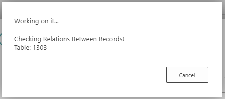

After the check on the table relations has run you can set a filter on the "No. of Table Relations Errors" to be <> 0. </br>
 You should then see if there are any basic table relation errors. </br>

 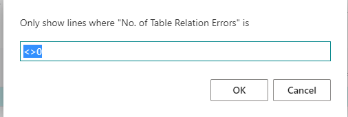

 If there are any errors you can make a drilldown on the number to see the errors. </br>

 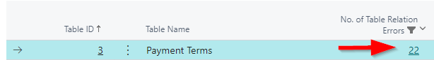

 These are the table relation errors in my example: </br>

 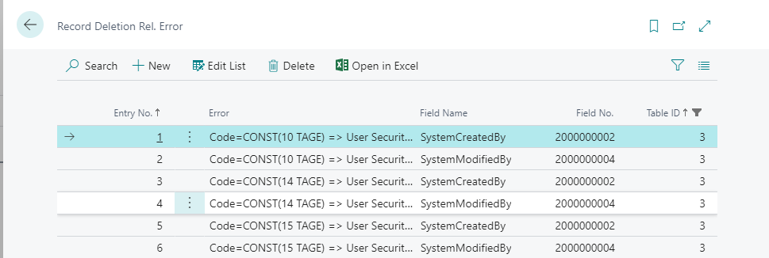

 As mentioned above, the table relation check is only doing a basic check, so don’t rely too much on it. </br>
 If you have a large amount of master data it might also take a while to run. </br>

 ### Table Editor

The **Table Editor** is a powerful tool that allows you to modify or delete specific records in any table. This is useful for data corrections, testing, and troubleshooting scenarios.

> **Credit:** Special thanks to [Yuri Mishin](https://www.linkedin.com/in/yuri-mishin-2a08a71b4/), who programmed the main functionality of this table editor.

#### Opening the Table Editor

Select any table in the table overview and click the **Edit Table** action.

 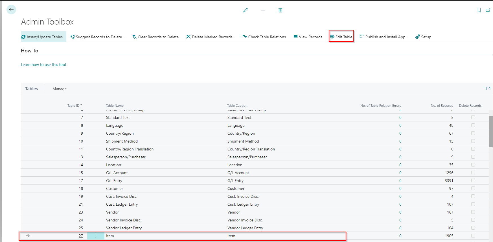

#### Table Editor Interface

The table editor provides the following configuration options:

 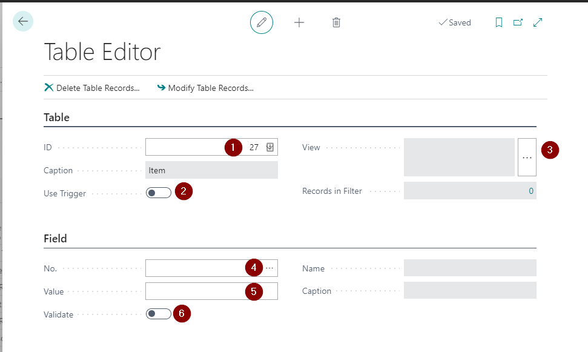

1. **ID**: The table you want to edit (pre-selected from the table overview)
2. **Use Trigger**: When enabled, OnModify/OnDelete triggers will fire during operations
3. **View**: Opens a filter dialog to select which records to modify or delete
4. **No.**: Select the field you want to modify in the filtered records
5. **Value**: The new value to assign to the selected field
6. **Validate**: When enabled, the OnValidate trigger of the field will fire during modification

#### Using the Table Editor

**To Delete Records:**
1. Set the **ID** field to your target table
2. Click **View** to filter the records you want to delete
3. Decide whether to enable **Use Trigger** (recommended for referential integrity)
4. Click **Delete Table Records**
5. Confirm the operation

 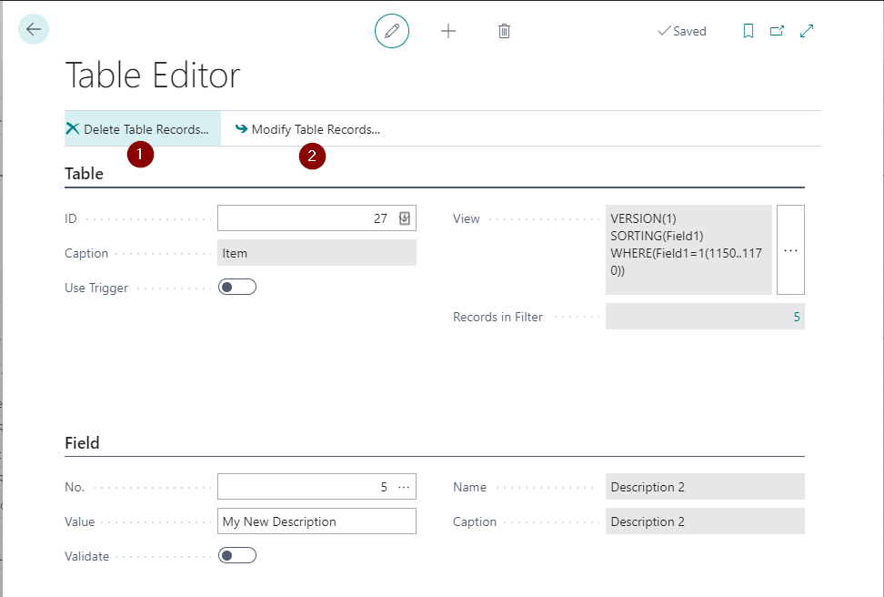

 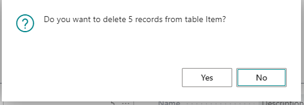

**To Modify Records:**
1. Set the **ID** field to your target table
2. Click **View** to filter the records you want to modify
3. Select the field **No.** you want to change
4. Enter the new **Value**
5. Decide whether to enable **Validate** (recommended to maintain business logic)
6. Decide whether to enable **Use Trigger**
7. Click **Modify Table Records**
8. Confirm the operation

 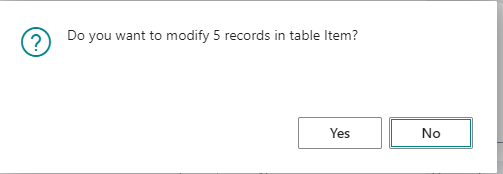

> ⚠️ **Warning:** The Table Editor directly manipulates database records. Always test your operations in a non-production environment first and ensure you have backups.

**Best Practices:**
- Enable **Use Trigger** when deleting to respect referential integrity
- Enable **Validate** when modifying to ensure business rules are applied
- Use specific filters to avoid affecting unintended records
- Test complex modifications on a single record first
- Always have a backup before making bulk changes

---

 ### Publishing & Installing Apps

The Admin Toolbox enables app publishing in OnPrem environments through integration with the External Deployer. This functionality is disabled by default in Business Central OnPrem installations but can be activated following the setup process.

#### Prerequisites

Before you can publish apps, you must install the **ALOps External Deployer**. See the [How to Install the External Deployer](#how-to-install-the-external-deployer) section at the end of this documentation for detailed instructions.

#### Publishing an App

1. Click the **Publish and Install App** action in the Admin Toolbox
2. A dialog will appear with two options:

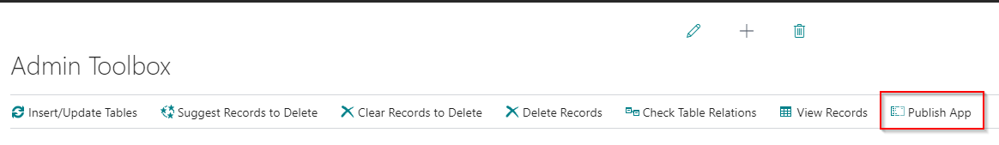

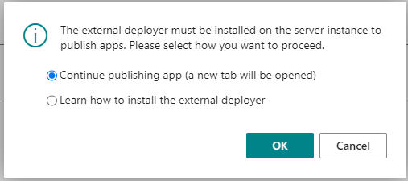

**Option 1: Learn how to install the external deployer**
- Opens the installation guide in a new tab
- Follow this option if you haven't installed the deployer yet
- Installing the deployer is a one-time setup process

**Option 2: Continue publishing app**
- Proceeds directly to the app publish dialog
- Only use this if you've already installed the External Deployer
- Without the deployer installed, publishing will fail with an error

#### Upload and Deploy

Once the External Deployer is installed, selecting "Continue publishing app" opens the standard Business Central app upload dialog:

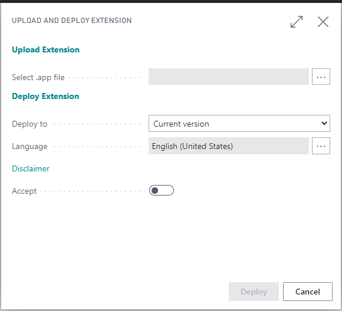

From here you can:
1. Select your .app file
2. Choose whether to install the app immediately
3. Select target companies (if applicable)
4. Complete the deployment

> **Note:** The External Deployer must be properly configured and the NST service restarted before app publishing will work. See the installation guide below for details.

---

 ### License Overview and Import

The **License Information** section provides visibility into your current Business Central license and allows you to import new license files.

#### Viewing License Information

The license area displays detailed information about your active license using data from the system table "License Information".

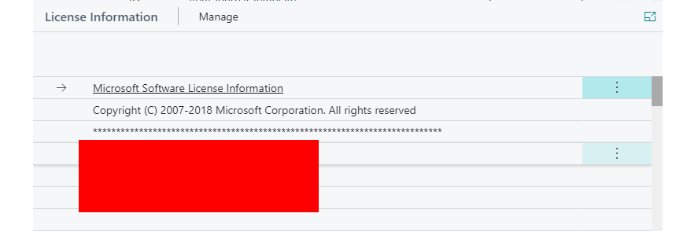

The display includes:
- License holder information
- Licensed database name
- Expiration dates
- Granule information
- Object range permissions

#### Developer License Indicator

A dedicated field shows whether your current license is a developer license:

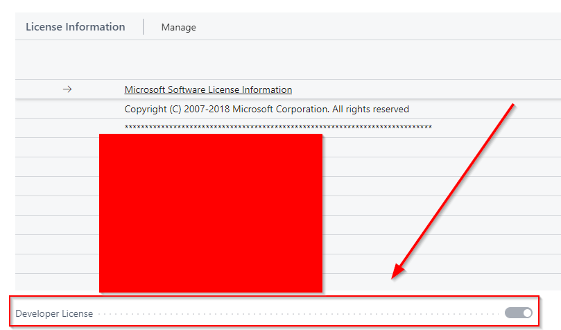

This indicator is useful for:
- Verifying you're using the correct license type
- Avoiding accidental development in production environments
- License compliance checks

#### Importing a New License

To import a new license file:

1. Click **Manage** → **Import License** in the License Information section

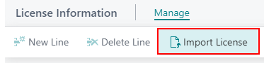

2. Select your license file (.flf format) from the file browser

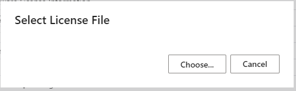

3. The license will be imported and the NST service will be restarted automatically
4. The license information will update to reflect the new license

> **Important:** Importing a license requires PowerShell integration and the appropriate PowerShell Runner DLL. License imports will restart the Business Central service, temporarily disconnecting all users.

**Best Practices:**
- Always backup your current license file before importing a new one
- Import licenses during scheduled maintenance windows to minimize user impact
- Verify the new license information after import to ensure it loaded correctly
- Keep a copy of all license files in a secure location

---

### Export License Object Information

The Admin Toolbox provides powerful reporting capabilities to analyze your license and identify which objects are used or missing in your license.

#### Export Used and Unused Objects in License

This report helps you identify which objects in your license are actively used and which are free/available for use. This is particularly useful for:
- License optimization and planning
- Identifying free object IDs for custom development
- Understanding license utilization

**To run the report:**
1. Go to the License Information section in the Admin Toolbox
2. Click on **Manage** → **Export Used and Unused Objects in License**
3. Configure the report options:
   - **Object Type**: Filter by specific object types (Table, Page, Codeunit, etc.) or leave blank for all types
   - **Object ID Filter**: Specify a range of object IDs (e.g., "50000..59999") or leave blank for all objects
   - **Only Free Objects**: Check this to export only unused/free objects in your license
   - **Used**: Select whether to include used objects, unused objects, or both

The report generates a list showing:
- Object Type
- Object ID
- Object Name
- Used status (Yes/No)

This information can help you identify which license granules are being utilized and which object ranges are available for customization.

#### Export Unlicensed Objects

This report identifies all objects in your database that are **not** covered by the current license. This is critical for:
- License compliance auditing
- Identifying objects that need licensing before go-live
- Troubleshooting permission errors related to unlicensed objects

**To run the report:**
1. Go to the License Information section in the Admin Toolbox
2. Click on **Manage** → **Export Unlicensed Objects**
3. Configure the report options:
   - **Object Type**: Filter by specific object types or leave blank for all types
   - **Object ID Filter**: Specify a range of object IDs or leave blank for all objects

The report generates a list showing:
- Object Type
- Object ID  
- Object Name

> **Important:** This report is especially useful when switching from a developer license to a customer license. It helps identify custom objects that were created under the developer license but are not included in the customer license, which could cause runtime errors.

---

### Links to Informational Tables

The **Information** section provides quick access to useful system tables that are not typically available through the standard Business Central interface. These tables contain valuable diagnostic and system information.

> **Credit:** This feature is inspired by [Waldo's blog post](https://www.waldo.be/2020/05/26/getting-not-out-of-the-box-information-with-the-out-of-the-box-web-client/) about accessing system information tables.

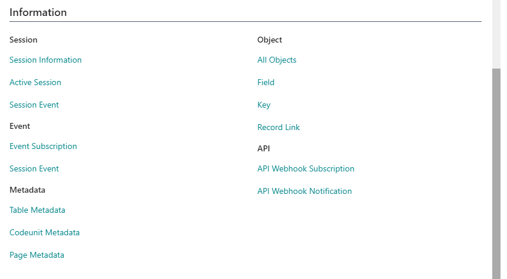

#### Available System Tables

The Information section provides clickable links to the following system tables:

**Session Information:**
- **Active Session**: View all active user sessions and their details
- **Session Event**: Review session-related events and activities
- **Session Information**: Detailed information about current sessions

**Metadata:**
- **Table Metadata**: Information about all tables in the database
- **Codeunit Metadata**: Details about codeunits and their properties
- **Page Metadata**: Information about pages and their structure

**Objects:**
- **All Objects**: Complete list of all objects in the system
- **Field**: Field definitions and properties across all tables
- **Key**: Table key definitions and configurations

**API:**
- **API Webhook Subscription**: Registered webhook subscriptions
- **API Webhook Notification**: Webhook notification history and status

**License:**
- **License Permission**: Detailed object permissions granted by the license

**Other:**
- **Record Link**: Record links and attachments throughout the system

#### Using the Links

Click any link to open the corresponding table in a new browser tab:

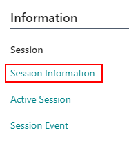 

The table opens with full access to all records and fields:

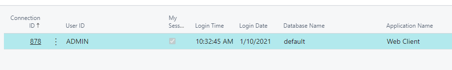 

**Common Use Cases:**
- **Active Session**: Monitor who is currently connected and what they're doing
- **Session Event**: Troubleshoot user session issues and track activities
- **Table/Page/Codeunit Metadata**: Understand database structure and object relationships
- **Field table**: Review field properties, types, and relations
- **API Webhook**: Monitor and troubleshoot API integrations
- **License Permission**: Verify which objects are covered by your license

--- 

### Show Developer License Warning

The **Developer License Warning** feature helps prevent accidental use of developer licenses in test or production environments by displaying an alert when users open the company.

#### Configuring the Warning

To enable this feature, open the Admin Toolbox Setup page:

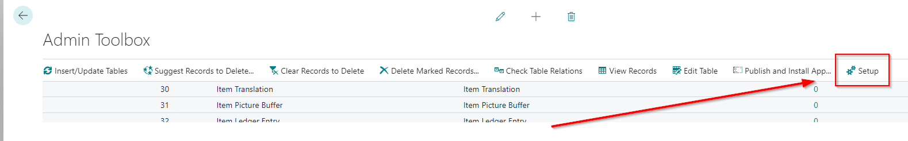 

In the setup page, enable the **Developer License Warning** field:

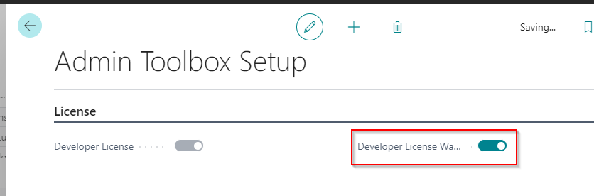 

#### How It Works

When the warning is enabled and a developer license is detected:
- Users with SUPER permissions will see an alert message when opening the company
- The warning appears automatically on the OnCompanyOpen trigger
- This helps prevent unintended development or data creation with a developer license

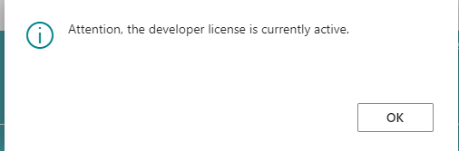 

#### Use Cases

**Test Environments:**
- Enable this warning to ensure the correct license is always active
- Prevents accidental import of developer licenses in test systems
- Helps maintain consistent testing conditions

**Production Environments:**
- Acts as a safety check if a developer license is mistakenly imported
- Alerts administrators immediately to the license mismatch
- Helps maintain license compliance

**Transition Scenarios:**
- Useful when switching between developer and customer licenses during development cycles
- Ensures team members are aware of the current license state

> **Note:** Only users with SUPER permissions will see this warning. Regular users will not be affected. The warning is informational only and does not prevent system use.

---

### How to Install the External Deployer

The External Deployer enables app publishing functionality in OnPrem Business Central environments by simulating the SaaS app deployment behavior.

> **Credit:** The following instructions are based on [Waldo's blog post about enabling External Deployment in OnPrem Business Central environments](https://www.waldo.be/2020/06/15/deploying-from-devops-the-right-way-enabling-external-deployment-in-onprem-business-central-environments/).

#### Important Disclaimer

? **Please read carefully before proceeding:**

The External Deployer is an unofficial tool that simulates SaaS extension deployment behavior in OnPrem environments. Please note:

- This tool is provided "as is" without official Microsoft support
- It replicates what occurs when uploading extensions through the Automation API in SaaS
- The tool depends on Business Central's architecture and may require updates with new BC versions
- It works only on standard Business Central installations (not copy/paste or non-standard setups)
- Feedback and issues should be reported through the ALOps GitHub repository


#### Installation Steps

The External Deployer is installed using a PowerShell module. Run these commands on the server hosting your Business Central NST (Server Tier).

##### Step 1: Install the PowerShell Module

Open PowerShell as Administrator and run:

```powershell
Install-Module ALOps.ExternalDeployer -Force
```

This downloads and installs the ALOps.ExternalDeployer module from the PowerShell Gallery.

##### Step 2: Import the Module

Load the module into your PowerShell session:

```powershell
Import-Module ALOps.ExternalDeployer
```

This makes the External Deployer commandlets available in your current session.


##### Step 3: Install the External Deployer Agent

Install the agent that handles app publishing:

```powershell
Install-ALOpsExternalDeployer
```

This installs a background agent that intercepts app upload requests through the Automation API and handles the actual publishing and installation.

##### Step 4: Link to Your NST Instance

Configure your Business Central server instance to use the External Deployer:

```powershell
New-ALOpsExternalDeployer -ServerInstance BC
```

> **Important:** Replace `BC` with your actual server instance name. Common names include:
> - `BC` or `BC240` (version-specific)
> - `MicrosoftDynamics365BusinessCentral`
> - Your custom instance name

This command:
- Updates the NST configuration with External Deployer settings
- Automatically restarts the NST service
- Applies the changes immediately


#### Verification

To verify the installation was successful:

1. Go to the Admin Toolbox
2. Click **Publish and Install App**
3. Select "Continue publishing app"
4. If the upload dialog appears, the External Deployer is working correctly

#### Troubleshooting

**Problem:** Upload fails or times out
- **Solution:** Verify the NST service restarted successfully after installation
- Check Windows Event Viewer for NST-related errors

**Problem:** "External Deployer not configured" error
- **Solution:** Re-run Step 4 with the correct server instance name
- Verify you have administrator rights on the server

**Problem:** Changes not taking effect
- **Solution:** Manually restart the Business Central service
- Clear browser cache and reconnect


---

## Support and Contributions

### Getting Help

If you encounter issues or have questions about the Admin Toolbox:

1. **Check the Documentation**: Review this README for usage instructions and troubleshooting
2. **GitHub Issues**: Open an issue on the [GitHub repository](https://github.com/wbrakowski/Admin-Toolbox-OnPrem/issues)
3. **Community Forums**: Ask questions on the Business Central community forums

### Contributing

Contributions to improve the Admin Toolbox are welcome! Here's how you can help:

**Bug Reports:**
- Open a GitHub issue with a clear description of the problem
- Include BC version, app version, and steps to reproduce
- Provide error messages and screenshots if applicable

**Feature Requests:**
- Suggest new features through GitHub issues
- Explain the use case and expected behavior
- Consider whether the feature fits the OnPrem focus of the tool


**Code Contributions:**
- Fork the repository and create a feature branch
- Follow existing code style and AL best practices
- Test your changes thoroughly before submitting
- Submit a pull request with a clear description of changes

**Translation Improvements:**
- The Spanish translation needs review and corrections
- Additional language translations are welcome
- Submit updated .xlf files through pull requests

### Acknowledgments

This project combines contributions from several talented developers in the Business Central community:

- **Olof Simren** - Original Record Deletion Tool for NAV
- **Yuri Mishin** - Table Editor and Developer License Warning
- **Waldo (Eric Wauters)** - License Information, System Tables, External Deployer
- **Neil Roberts** - PowerShell License Import
- **Roberto Stefanetti** - Used/Unused Objects Analysis
- **Waldemar Brakowski** - Integration, enhancements, and maintenance

Thank you to everyone who has contributed to making this tool valuable for the Business Central community!


### License

This project is released under the MIT License. See the LICENSE file for details.

---

**Version**: 27.0.0.0
**Last Updated**: December 2025
**Repository**: [https://github.com/wbrakowski/Admin-Toolbox-OnPrem](https://github.com/wbrakowski/Admin-Toolbox-OnPrem)
